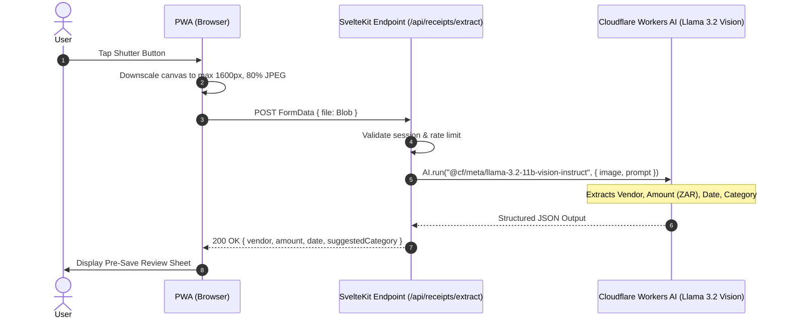

# Brickwork — API & Server Workflows Specification

**Version:** 0.1 (Draft)  
**Date:** 16 September 2026  
**Author:** Stefan van Dyk  
**Status:** DRAFT  

---

## 1. Overview & Architecture Patterns

Brickwork follows standard **SvelteKit 2** conventions:
- **Server Form Actions (`+page.server.ts`)** are used for state mutations (creating expenses, updating categories, changing settings, deleting records) to enable native form handling and progressive enhancement without complex client state.
- **REST / Stream Endpoints (`+server.ts`)** are used for multipart binary uploads (camera image extraction) and authenticated file streaming from Cloudflare R2.
- **Validation**: Strict schema validation on all inputs before executing D1 or R2 operations.

---

## 2. Receipt Extraction & Image Pipeline

### 2.1 Extraction Endpoint: `POST /api/receipts/extract`

Processes the camera frame through Cloudflare Workers AI before persistence.



#### Request Payload
- `Content-Type`: `multipart/form-data`
- `file`: JPEG binary blob (< 1 MB)

#### AI Prompt Template
```text
You are an expert South African receipt parser. Analyze this till slip image and extract:
1. Vendor / Merchant name (e.g. Checkers, Pick n Pay, Woolworths, Engen, Shell, Builders)
2. Total Amount in ZAR (convert to decimal number, ignore discounts or savings)
3. Transaction date in YYYY-MM-DD format (convert DD/MM/YYYY if necessary)
4. Suggested category chosen from: Groceries, Fuel & Travel, Dining, Utilities, Maintenance, Office Supplies, General

Respond ONLY with valid JSON in this exact structure:
{
  "vendor_name": string,
  "amount": number,
  "transaction_date": string,
  "suggested_category": string,
  "confidence": number
}
```

#### Fallback Behavior
If Cloudflare AI fails to respond within 2.5 seconds or fails schema validation:
- The endpoint returns `{ success: false, fallback: true }`.
- The client seamlessly advances to the review screen with blank fields and the captured thumbnail, allowing manual entry without blocking the user.

---

### 2.2 Authenticated Receipt Stream: `GET /api/receipts/[id]`

- Validates that the active session has access to the company owning the expense.
- Reads object from Cloudflare R2: `platform.env.RECEIPTS_BUCKET.get(key)`.
- Sets immutable caching headers:
  ```http
  Content-Type: image/jpeg
  Cache-Control: private, max-age=31536000, immutable
  ```

---

## 3. Server Actions Specification

### 3.1 Expense Actions (`/capture` and `/expenses/+page.server.ts`)

#### `create` Action
1. Validates form data: `vendorName`, `amountCents`, `transactionDate`, `companyId`, `categoryId`, `accountId`, `receiptImageBase64`, `isReimbursable`, `reimbursableCompanyId`.
2. If `isReimbursable` is true, validates that active company is Personal and `reimbursableCompanyId` references an active business company.
3. Generates unique expense ID `exp_${nanoid()}` and R2 key:
   ```text
   receipts/${companyId}/${year}/${month}/${expenseId}.jpg
   ```
4. Writes binary buffer to Cloudflare R2 via `platform.env.RECEIPTS_BUCKET.put()`.
5. Inserts row into D1 `expenses` table.
6. Redirects to `/dashboard` with success notification.

#### `update` Action
1. Validates user ownership or company access.
2. Updates editable fields (`vendorName`, `amountCents`, `transactionDate`, `categoryId`, `accountId`, `isReimbursable`, `reimbursableCompanyId`) in D1.

#### `delete` Action
1. Retrieves target expense from D1 to get `receiptImageKey`.
2. Deletes object from Cloudflare R2: `platform.env.RECEIPTS_BUCKET.delete(receiptImageKey)`.
3. Deletes record from D1 `expenses` table.

---

### 3.2 Company & Category Actions (`/manage/+page.server.ts` & `/settings/+page.server.ts`)

- `createCompany`: Main Member only. Creates company record and seeds default starter categories and default payment account.
- `updateCompany`: Renames company (Creator/Owner only). Personal company cannot be renamed or deleted.
- `deleteCompany`: Creator/Owner only. Cascades deletion to linked categories, accounts, members, and expenses (with corresponding R2 object cleanup).
- `createCategory`: Creator/Owner OR member with `canManageCategories = true`. Adds category with initial monthly spend target.
- `updateCategory`: Creator/Owner OR member with `canManageCategories = true`. Updates category name, color, and `monthlyTargetCents`.
- `deleteCategory`: Creator/Owner OR member with `canManageCategories = true`. Soft checks that no historical expenses reference the category before deletion.
- `addCompanyMember`: Creator/Owner only. Accepts `email` and `canManageCategories`. Verifies registered user exists and creates `company_member` link.
- `removeCompanyMember`: Creator/Owner only. Accepts `memberId` and revokes company access.
- `toggleMemberCategoryPermission`: Creator/Owner only. Updates `canManageCategories` flag for target member.
- `createPaymentAccount`: Adds account (e.g. "FNB Credit Card").
- `setDefaultPaymentAccount`: Sets target account `isDefault = true` and unsets other accounts for the company.

---

### 3.3 User & Cycle Settings Actions (`/settings/+page.server.ts`)

- `updateSettings`:
  - `monthStartDay`: Integer 1–28. Validates bounds; immediately recalculates active cycle on next dashboard load.
  - `defaultCompanyId`: References valid company ID owned or collaborated on by user.

---

### 3.4 Password Reset Actions (`/auth/forgot-password` & `/auth/reset-password`)

- `forgotPassword`:
  1. Finds user by email in D1.
  2. Generates 32-byte cryptographic token `crypto.getRandomValues()`.
  3. Hashes token with SHA-256 and stores in `passwordResetTokens` with 1-hour expiration.
  4. Dispatches email via Cloudflare Email Send:
     ```typescript
     await platform.env.EMAIL.send({
       from: "noreply@brickwork.co.za",
       to: user.email,
       subject: "Reset your Brickwork password",
       text: `Click the link to reset your password: ${APP_URL}/auth/reset-password?token=${rawToken}`
     });
     ```
- `resetPassword`:
  1. Validates token hash and checks `expiresAt > Date.now()` and `usedAt IS NULL`.
  2. Hashes new password and updates Better Auth account credential.
  3. Marks token as used (`usedAt = Date.now()`).
  4. Revokes existing user sessions to force fresh login.

---

### 3.5 Dashboard Date Range Filtering (`GET /dashboard?from=...&to=...`) (AC-17)

- Query Parameters:
  - `from`: Start date in `YYYY-MM-DD` format.
  - `to`: End date in `YYYY-MM-DD` format.
- Processing:
  - If both `from` and `to` are present and valid, overrides default `calculateCycleWindow(monthStartDay)`.
  - Aggregates `cycleExpenses` within `[from, to]` for active company.
  - Returns `isFiltered: true`, active `startDate`, and `endDate` to client.
  - Enables warning styling on the Filter trigger button (`btn-warning`).

---

### 3.6 Digital / Emailed Receipt File Upload (`/capture`) (AC-19)

- Workflow:
  1. User selects "Upload File" tab on `/capture` or drops file onto drag-and-drop zone.
  2. Client-side validation checks file MIME type (`image/png`, `image/jpeg`, `image/webp`).
  3. Image is downscaled to max 1600px via HTML5 Canvas and compressed to WebP (0.82 quality) in the browser.
  4. Dispatches to `POST /api/extract` for Cloudflare Workers AI OCR extraction.
  5. Advances to `PreSaveBottomSheet` populated with extracted metadata and local preview.

