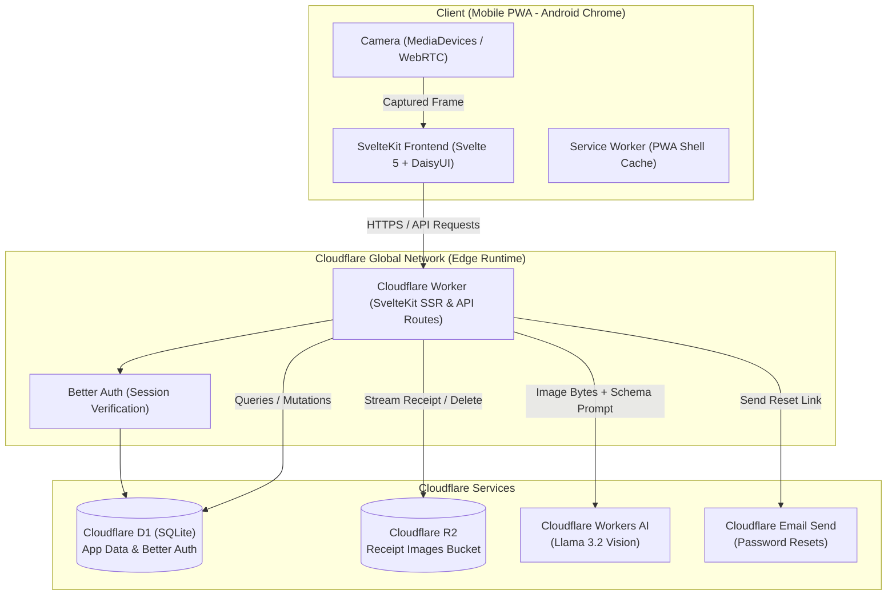
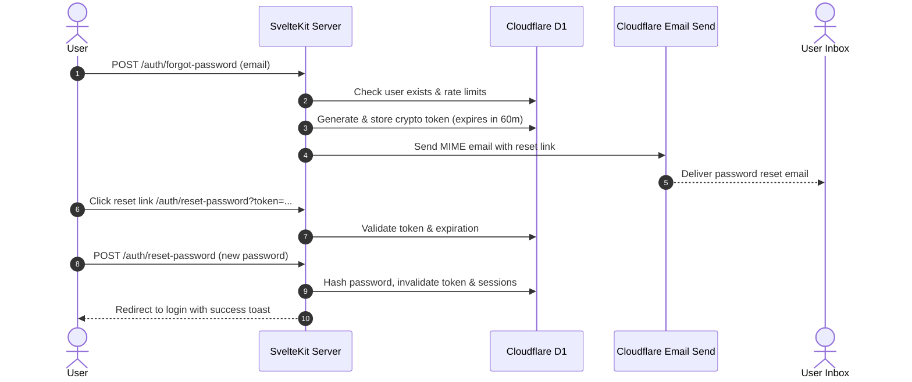

# Brickwork — System Architecture & Cloudflare Topology

**Version:** 0.1 (Draft)  
**Date:** 16 September 2026  
**Author:** Stefan van Dyk  
**Status:** DRAFT  

---

## 1. System Overview

Brickwork is built as a serverless, edge-native Progressive Web Application (PWA). It leverages Cloudflare's full stack of developer products to deliver sub-2-second response times, zero cold starts, and near-zero idle infrastructure costs.



---

## 2. Runtime & Edge Topology

### 2.1 SvelteKit on Cloudflare Workers
- **Adapter**: `@sveltejs/adapter-cloudflare` (`cfTarget: workers`)
- **Compilation**: SvelteKit routes and server endpoints compile into a single ES Module entry point at `.svelte-kit/cloudflare/_worker.js`.
- **Static Assets**: Handled by Cloudflare Workers Assets (`ASSETS` binding) for instant caching across global PoPs without hitting Worker CPU quotas.
- **Node.js Compatibility**: `compatibility_flags = ["nodejs_als"]` enables AsyncLocalStorage required for scoped session contexts.

### 2.2 Cloudflare Bindings in `wrangler.jsonc`

```jsonc
{
  "$schema": "./node_modules/wrangler/config-schema.json",
  "name": "brickwork",
  "compatibility_date": "2026-09-16",
  "compatibility_flags": ["nodejs_als"],
  "main": ".svelte-kit/cloudflare/_worker.js",
  "assets": {
    "binding": "ASSETS",
    "directory": ".svelte-kit/cloudflare"
  },
  "d1_databases": [
    {
      "binding": "DB",
      "database_name": "brickwork-db",
      "database_id": "<CLOUDFLARE_D1_DATABASE_ID>"
    }
  ],
  "r2_buckets": [
    {
      "binding": "RECEIPTS_BUCKET",
      "bucket_name": "brickwork-receipts"
    }
  ],
  "ai": {
    "binding": "AI"
  },
  "send_email": [
    {
      "name": "EMAIL",
      "destination_address": "noreply@brickwork.co.za"
    }
  ],
  "vars": {
    "APP_URL": "https://brickwork.pages.dev",
    "TIMEZONE": "Africa/Johannesburg"
  }
}
```

---

## 3. Cloudflare Workers AI Pipeline (Receipt Extraction)

### 3.1 Model Selection
- **Model**: `@cf/meta/llama-3.2-11b-vision-instruct`
- **Capabilities**: Multimodal model running directly on Cloudflare GPU workers. It accepts image binary arrays and complex instructional system prompts, yielding structured JSON without requiring external OCR services.

### 3.2 Prompt & Extraction Strategy
South African till slips (Pick n Pay, Checkers, Woolworths, Spar, Engen, Total, etc.) frequently contain:
- VAT registration numbers and tax breakdown tables
- Discounts, loyalty club savings, and dual-column totals
- Date formats in both `DD/MM/YYYY` and `YYYY-MM-DD`
- Currency markers as `R`, `ZAR`, or bare numbers

**Extraction Pipeline**:
1. **Client pre-processing**: The client downscales the camera frame to a max dimension of 1600px with 80% JPEG quality to ensure payload transmission remains under 500KB and network upload takes <500ms.
2. **Worker processing**: The image bytes are passed to `platform.env.AI.run('@cf/meta/llama-3.2-11b-vision-instruct', ...)`.
3. **Structured Response**:
   ```json
   {
     "vendor_name": "Checkers Hyper",
     "amount": 452.80,
     "transaction_date": "2026-09-14",
     "suggested_category": "Groceries",
     "confidence": 0.95
   }
   ```
4. **Latency Budget**: Total roundtrip target is <2000ms. If the AI model response degrades due to queue latency, a timeout gracefully surfaces the image to the user for manual entry on the review screen.

---

## 4. Cloudflare R2 Storage Architecture

### 4.1 Bucket Layout & Key Structure
All receipt images are stored privately in `RECEIPTS_BUCKET`:
```text
receipts/{company_id}/{year}/{month}/{expense_id}.jpg
```
*For personal expenses, `{company_id}` is the user's personal entity ID.*

### 4.2 Security & Access
- **Private Bucket**: The R2 bucket has public access disabled.
- **Serving Mechanism**: An authenticated SvelteKit proxy route `/api/receipts/[id]` verifies that the requesting user belongs to the company before streaming the object via `platform.env.RECEIPTS_BUCKET.get(key)`.
- **Cache Headers**: Images are immutable; responses serve `Cache-Control: private, max-age=31536000, immutable`.
- **Deletion Lifecycle**: When an expense record is deleted, the server deletes the R2 object via `platform.env.RECEIPTS_BUCKET.delete(key)` in the same transaction flow.

---

## 5. Authentication & Authorization (Better Auth)

### 5.1 Auth Engine
- **Engine**: Better Auth configured with SQLite / D1 adapter.
- **Storage**: Standard Better Auth tables (`user`, `session`, `account`, `verification`) maintained in Cloudflare D1 via Drizzle schemas.
- **Password Strategy**: Argon2id password hashing implemented natively or via WebCrypto-compatible primitives.
- **Session Model**: Secure, HTTP-Only, SameSite=Lax cookies with automatic rolling expiry.

### 5.2 Roles & Access Control
- **Main Member**: The registered owner of the account. Can create/edit companies, define categories, set spend targets, modify billing cycle start dates, and manage payment accounts.
- **Member**: Subordinate user (invited in future versions; seeded in MVP model). Can create, view, edit, and delete their assigned expenses and inspect company dashboards.

---

## 6. Password Reset Flow (Cloudflare Email Send)



---

## 7. Progressive Web Application (PWA) Implementation

### 7.1 Android Chrome Target
- **Web Manifest** (`static/manifest.webmanifest`):
  - `name`: "Brickwork Expense Tracker"
  - `short_name`: "Brickwork"
  - `display`: "standalone"
  - `theme_color`: "#1E293B"
  - `background_color`: "#0F172A"
  - `orientation`: "portrait-primary"
- **Camera Access**:
  - Primary: HTML5 `navigator.mediaDevices.getUserMedia({ video: { facingMode: { exact: "environment" } } })`
  - Fallback: HTML5 file input `<input type="file" accept="image/*" capture="environment">`
- **Offline / Caching**:
  - Service Worker precaches the UI shell, stylesheets, web fonts, and DaisyUI icons.
  - Transactions require real-time AI and R2 upload; if offline, user receives an immediate connection status warning banner.
