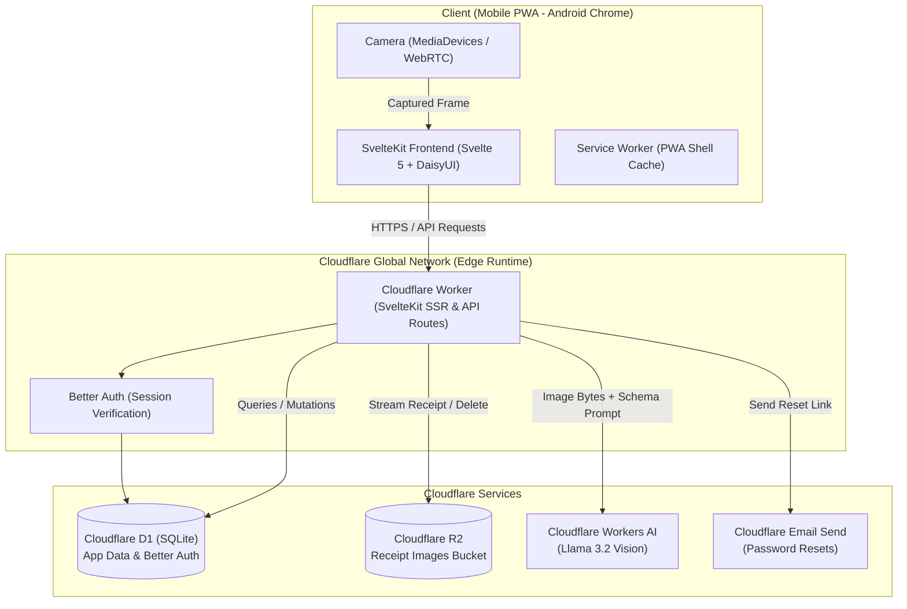
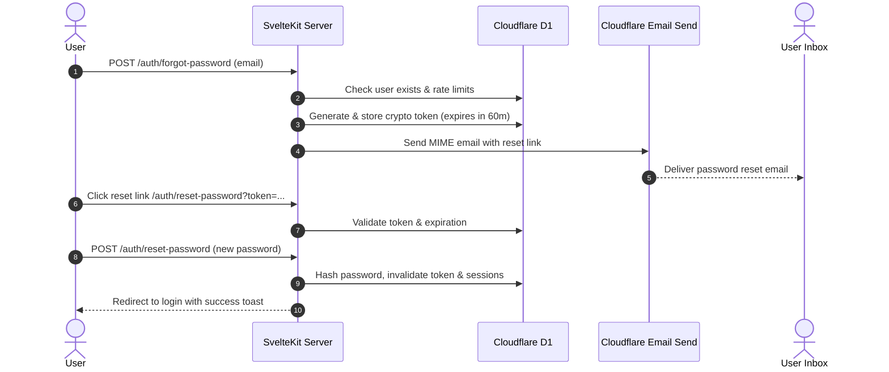

# Brickwork — System Architecture & Cloudflare Topology

**Version:** 0.1 (Draft)  
**Date:** 16 September 2026  
**Author:** Stefan van Dyk  
**Status:** DRAFT  

---

## 1. System Overview

Brickwork is built as a serverless, edge-native Progressive Web Application (PWA). It leverages Cloudflare's full stack of developer products to deliver sub-2-second response times, zero cold starts, and near-zero idle infrastructure costs.


```mermaid
flowchart TD
    subgraph Client["Client (Mobile PWA - Android Chrome)"]
        UI["SvelteKit Frontend (Svelte 5 + DaisyUI)"]
        Cam["Camera (MediaDevices / WebRTC)"]
        SW["Service Worker (PWA Shell Cache)"]
    end

    subgraph Edge["Cloudflare Global Network (Edge Runtime)"]
        Worker["Cloudflare Worker (SvelteKit SSR & API Routes)"]
        Auth["Better Auth (Session Verification)"]
    end

    subgraph CF_Services["Cloudflare Services"]
        D1[("Cloudflare D1 (SQLite)\nApp Data & Better Auth")]
        R2[("Cloudflare R2\nReceipt Images Bucket")]
        WAI["Cloudflare Workers AI\n(Llama 3.2 Vision)"]
        Email["Cloudflare Email Send\n(Password Resets)"]
    end

    Cam -->|Captured Frame| UI
    UI -->|HTTPS / API Requests| Worker
    Worker --> Auth
    Auth --> D1
    Worker -->|Queries / Mutations| D1
    Worker -->|Stream Receipt / Delete| R2
    Worker -->|Image Bytes + Schema Prompt| WAI
    Worker -->|Send Reset Link| Email
```

---

## 2. Runtime & Edge Topology

### 2.1 SvelteKit on Cloudflare Workers
- **Adapter**: `@sveltejs/adapter-cloudflare` (`cfTarget: workers`)
- **Compilation**: SvelteKit routes and server endpoints compile into a single ES Module entry point at `.svelte-kit/cloudflare/_worker.js`.
- **Static Assets**: Handled by Cloudflare Workers Assets (`ASSETS` binding) for instant caching across global PoPs without hitting Worker CPU quotas.
- **Node.js Compatibility**: `compatibility_flags = ["nodejs_als"]` enables AsyncLocalStorage required for scoped session contexts.

### 2.2 Cloudflare Bindings in `wrangler.jsonc`

```jsonc
{
  "$schema": "./node_modules/wrangler/config-schema.json",
  "name": "brickwork",
  "compatibility_date": "2026-09-16",
  "compatibility_flags": ["nodejs_als"],
  "main": ".svelte-kit/cloudflare/_worker.js",
  "assets": {
    "binding": "ASSETS",
    "directory": ".svelte-kit/cloudflare"
  },
  "d1_databases": [
    {
      "binding": "DB",
      "database_name": "brickwork-db",
      "database_id": "<CLOUDFLARE_D1_DATABASE_ID>"
    }
  ],
  "r2_buckets": [
    {
      "binding": "RECEIPTS_BUCKET",
      "bucket_name": "brickwork-receipts"
    }
  ],
  "ai": {
    "binding": "AI"
  },
  "send_email": [
    {
      "name": "EMAIL",
      "destination_address": "noreply@brickwork.co.za"
    }
  ],
  "vars": {
    "APP_URL": "https://brickwork.pages.dev",
    "TIMEZONE": "Africa/Johannesburg"
  }
}
```

---

## 3. Cloudflare Workers AI Pipeline (Receipt Extraction)

### 3.1 Model Selection
- **Model**: `@cf/meta/llama-3.2-11b-vision-instruct`
- **Capabilities**: Multimodal model running directly on Cloudflare GPU workers. It accepts image binary arrays and complex instructional system prompts, yielding structured JSON without requiring external OCR services.

### 3.2 Prompt & Extraction Strategy
South African till slips (Pick n Pay, Checkers, Woolworths, Spar, Engen, Total, etc.) frequently contain:
- VAT registration numbers and tax breakdown tables
- Discounts, loyalty club savings, and dual-column totals
- Date formats in both `DD/MM/YYYY` and `YYYY-MM-DD`
- Currency markers as `R`, `ZAR`, or bare numbers

**Extraction Pipeline**:
1. **Real-Time Document Detection & 4-Point Homography Perspective Dewarping (AC-25)**:
   - *Live Viewfinder Detection*: Camera frames are downscaled onto an offscreen canvas running real-time edge and quadrilateral contour detection, smoothing the 4 paper corners across frames and projecting an animated SVG boundary overlay directly over the physical receipt.
   - *Stability Auto-Capture*: When detected corner drift drops below the motion threshold for >500ms and Laplacian sharpness confirms no motion blur, the shutter fires automatically.
   - *Projective Homography Dewarping*: The 4 detected corners $(P_1, P_2, P_3, P_4)$ are transformed via a 3x3 projective homography matrix (Heckbert inverse quadrilateral mapping with bilinear interpolation), geometrically straightening tilted/angled till slips into flat, upright top-down rectangular scans before filter enhancement and storage. If no clear quadrilateral boundary is identified, it seamlessly falls back to the reticle guide crop.
2. **Car-Capture Ergonomics & Hardware Controls**:
   - *Hardware Torch / Flashlight*: MediaTrackCapabilities torch constraint toggling for low-light vehicle cabin environments.
   - *Multi-Frame Best-Shot Selection*: Rapid 3-frame burst evaluating Laplacian edge variance to automatically pick the sharpest frame and discard motion blur.
3. **Dual-Stream Client Preprocessing**:
   - **Record Stream**: The unadulterated, high-resolution color cropped photo is compressed as high-quality WebP (0.85) for Cloudflare R2 audit storage.
   - **OCR Stream**: The cropped frame undergoes a 4-stage Canvas 2D image processing filter pipeline (< 40ms):
     1. *Grayscale Normalization*: Rec. 601 luma weighting ($0.299R + 0.587G + 0.114B$) stripping background color distraction.
     2. *Adaptive Shadow Division*: Bilinearly interpolated local background luminance division that completely eliminates hand and phone cast shadows across the slip.
     3. *Auto-Levels Histogram Contrast*: Linear stretching between the 2nd and 98th percentiles to render faint thermal printing in deep black.
     4. *High-Frequency Unsharp Masking*: 3x3 Laplacian sharpening convolution kernel crispening dot-matrix characters and decimal points.
4. **Worker Processing & Resilient Parser**:
   - The enhanced image bytes, dynamic company categories, and registered company payment cards are processed via `@cf/meta/llama-3.2-11b-vision-instruct`.
   - The model extracts merchant, total, date, category, and payment card details (card brand and digits).
   - If the AI responds in conversational markdown instead of strict JSON, a robust multi-pattern regex extraction engine parses all required fields, ensuring 0 dropped extractions.
   - Card digits and brand are matched against the user's saved payment accounts in D1, automatically selecting `suggestedAccountId`.
5. **Structured Response**:
   ```json
   {
     "vendor_name": "Checkers Hyper",
     "amount": 452.80,
     "transaction_date": "2026-09-14",
     "suggested_category": "Groceries",
     "suggested_account_id": "acc-fnb-1357",
     "detected_card_digits": "1357",
     "confidence": 0.95
   }
   ```
6. **Latency Budget**: Total roundtrip target is <2000ms. If the AI model response degrades due to queue latency, a timeout gracefully surfaces the image to the user for manual entry on the review screen.

### 3.3 OCR Accuracy Tracking & Evaluation Architecture (AC-23)
To ensure continuous visibility into AI extraction quality and model performance across real-world physical receipts:
1. **Delta Comparison Engine**: When an expense is finalized in the `PreSaveBottomSheet` and saved, the platform compares the initial AI extraction payload against the user's final saved values across four core fields:
   - `vendorName`
   - `amountCents`
   - `transactionDate`
   - `categoryId`
2. **Classification Heuristics**:
   - **Full Match (`full_success`)**: All 4 fields kept as analysed by the AI (0 fields altered).
   - **Partial Fail (`partial_fail`)**: 1 to 3 fields altered by the user (e.g., corrected vendor spelling or adjusted category).
   - **Total Fail (`total_fail`)**: All 4 fields altered by the user (complete re-entry).
3. **Persistence & Auditing**:
   - Recorded in Cloudflare D1 table `ocr_accuracy_log`, referencing `expense_id`, `company_id`, and `user_id`.
   - Preserves extracted vs final values, field-by-field change booleans, and changed field counts for longitudinal accuracy trend analysis.
4. **Settings Analytics Dashboard**:
   - Rendered in `/settings` featuring KPI stat cards (Overall Accuracy, Partial Rate, Total Fail Rate, and field-by-field accuracy percentages).
   - A historical audit table detailing recent receipt extractions with side-by-side comparison badges.

---

## 4. Cloudflare R2 Storage Architecture

### 4.1 Bucket Layout & Dual-Stream Key Structure (AC-24)
All receipt images are stored privately in `RECEIPTS_BUCKET` using dual-stream storage:
- **Original Photo** (`receipt_image_key`): Natural-color cropped receipt photo for legal accounting records:
  ```text
  receipts/{company_id}/{year}/{month}/{expense_id}.webp
  ```
- **Enhanced OCR Scan** (`ocr_image_key`): Shadow-removed, high-contrast, edge-sharpened image passed to Workers AI:
  ```text
  receipts/{company_id}/{year}/{month}/{expense_id}-ocr.jpg
  ```
*For personal expenses, `{company_id}` is the user's personal entity ID.*

### 4.2 Security & Access
- **Private Bucket**: The R2 bucket has public access disabled.
- **Serving Mechanism**: An authenticated SvelteKit proxy route `/api/receipts/[...key]` verifies that the requesting user owns the company or the associated expense before streaming the object via `platform.env.RECEIPTS_BUCKET.get(key)`.
- **Cache Headers**: Images are immutable; responses serve `Cache-Control: private, max-age=31536000, immutable`.
- **Deletion Lifecycle**: When an expense record is deleted, the server deletes both the original (`receiptImageKey`) and filtered OCR (`ocrImageKey`) R2 objects via `platform.env.RECEIPTS_BUCKET.delete(key)` in the same transaction flow.

---

## 5. Authentication & Authorization (Better Auth)

### 5.1 Auth Engine
- **Engine**: Better Auth configured with SQLite / D1 adapter.
- **Storage**: Standard Better Auth tables (`user`, `session`, `account`, `verification`) maintained in Cloudflare D1 via Drizzle schemas.
- **Password Strategy**: Argon2id password hashing implemented natively or via WebCrypto-compatible primitives.
- **Session Model**: Secure, HTTP-Only, SameSite=Lax cookies with automatic rolling expiry.

### 5.2 Roles & Access Control
- **Main Member**: The registered owner of the account. Can create/edit companies, define categories, set spend targets, modify billing cycle start dates, and manage payment accounts.
- **Member**: Subordinate user (invited in future versions; seeded in MVP model). Can create, view, edit, and delete their assigned expenses and inspect company dashboards.

---

## 6. Password Reset Flow (Cloudflare Email Send)


```mermaid
sequenceDiagram
    autonumber
    actor User
    participant App as SvelteKit Server
    participant D1 as Cloudflare D1
    participant CF_Email as Cloudflare Email Send
    actor Mailbox as User Inbox

    User->>App: POST /auth/forgot-password (email)
    App->>D1: Check user exists & rate limits
    App->>D1: Generate & store crypto token (expires in 60m)
    App->>CF_Email: Send MIME email with reset link
    CF_Email-->>Mailbox: Deliver password reset email
    User->>App: Click reset link /auth/reset-password?token=...
    App->>D1: Validate token & expiration
    User->>App: POST /auth/reset-password (new password)
    App->>D1: Hash password, invalidate token & sessions
    App-->>User: Redirect to login with success toast
```

---

## 7. Progressive Web Application (PWA) Implementation

### 7.1 Android Chrome Target
- **Web Manifest** (`static/manifest.webmanifest`):
  - `name`: "Brickwork Expense Tracker"
  - `short_name`: "Brickwork"
  - `display`: "standalone"
  - `theme_color`: "#1E293B"
  - `background_color`: "#0F172A"
  - `orientation`: "portrait-primary"
- **Camera Access**:
  - Primary: HTML5 `navigator.mediaDevices.getUserMedia({ video: { facingMode: { exact: "environment" } } })`
  - Fallback: HTML5 file input `<input type="file" accept="image/*" capture="environment">`
- **Offline / Caching**:
  - Service Worker precaches the UI shell, stylesheets, web fonts, and DaisyUI icons.
  - Transactions require real-time AI and R2 upload; if offline, user receives an immediate connection status warning banner.
