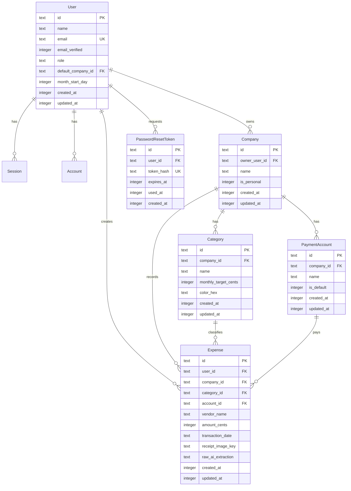

# Brickwork — Database Schema & Data Modeling

**Version:** 0.1 (Draft)  
**Date:** 16 September 2026  
**Author:** Stefan van Dyk  
**Status:** DRAFT  

---

## 1. Overview

Brickwork uses **Cloudflare D1** (serverless SQLite at the edge) paired with **Drizzle ORM**. 

To prevent floating-point rounding errors when calculating financial summaries and VAT, all monetary amounts are represented as **integer cents (ZAR)** (e.g. `R 452.80` is stored as `45280`).

---

## 2. Entity Relationship Diagram



---

## 3. Drizzle ORM Schema Specification

### 3.1 Better Auth Core Tables

```typescript
// src/lib/server/db/schema.ts
import { sqliteTable, text, integer, index } from 'drizzle-orm/sqlite-core';

export const users = sqliteTable('users', {
  id: text('id').primaryKey(),
  name: text('name').notNull(),
  email: text('email').notNull().unique(),
  emailVerified: integer('email_verified', { mode: 'boolean' }).notNull().default(false),
  image: text('image'),
  role: text('role', { enum: ['main_member', 'member'] }).notNull().default('main_member'),
  defaultCompanyId: text('default_company_id'),
  monthStartDay: integer('month_start_day').notNull().default(1), // 1 to 28
  createdAt: integer('created_at', { mode: 'timestamp' }).notNull(),
  updatedAt: integer('updated_at', { mode: 'timestamp' }).notNull()
});

export const sessions = sqliteTable('sessions', {
  id: text('id').primaryKey(),
  userId: text('user_id').notNull().references(() => users.id, { onDelete: 'cascade' }),
  token: text('token').notNull().unique(),
  expiresAt: integer('expires_at', { mode: 'timestamp' }).notNull(),
  ipAddress: text('ip_address'),
  userAgent: text('user_agent'),
  createdAt: integer('created_at', { mode: 'timestamp' }).notNull(),
  updatedAt: integer('updated_at', { mode: 'timestamp' }).notNull()
});

export const accounts = sqliteTable('accounts', {
  id: text('id').primaryKey(),
  userId: text('user_id').notNull().references(() => users.id, { onDelete: 'cascade' }),
  accountId: text('account_id').notNull(),
  providerId: text('provider_id').notNull(),
  password: text('password'),
  createdAt: integer('created_at', { mode: 'timestamp' }).notNull(),
  updatedAt: integer('updated_at', { mode: 'timestamp' }).notNull()
});

export const verifications = sqliteTable('verifications', {
  id: text('id').primaryKey(),
  identifier: text('identifier').notNull(),
  value: text('value').notNull(),
  expiresAt: integer('expires_at', { mode: 'timestamp' }).notNull(),
  createdAt: integer('created_at', { mode: 'timestamp' }),
  updatedAt: integer('updated_at', { mode: 'timestamp' })
});
```

### 3.2 Business Entities: Companies, Categories & Payment Accounts

```typescript
export const companies = sqliteTable('companies', {
  id: text('id').primaryKey(),
  ownerUserId: text('owner_user_id').notNull().references(() => users.id, { onDelete: 'cascade' }),
  name: text('name').notNull(),
  isPersonal: integer('is_personal', { mode: 'boolean' }).notNull().default(false),
  createdAt: integer('created_at', { mode: 'timestamp' }).notNull(),
  updatedAt: integer('updated_at', { mode: 'timestamp' }).notNull()
}, (table) => ({
  ownerIdx: index('idx_companies_owner').on(table.ownerUserId)
}));

export const categories = sqliteTable('categories', {
  id: text('id').primaryKey(),
  companyId: text('company_id').notNull().references(() => companies.id, { onDelete: 'cascade' }),
  name: text('name').notNull(),
  monthlyTargetCents: integer('monthly_target_cents').notNull().default(0), // in ZAR cents
  colorHex: text('color_hex').notNull().default('#3b82f6'),
  createdAt: integer('created_at', { mode: 'timestamp' }).notNull(),
  updatedAt: integer('updated_at', { mode: 'timestamp' }).notNull()
}, (table) => ({
  companyIdx: index('idx_categories_company').on(table.companyId)
}));

export const paymentAccounts = sqliteTable('payment_accounts', {
  id: text('id').primaryKey(),
  companyId: text('company_id').notNull().references(() => companies.id, { onDelete: 'cascade' }),
  name: text('name').notNull(), // e.g. "FNB Cheque", "Credit Card", "Cash"
  isDefault: integer('is_default', { mode: 'boolean' }).notNull().default(false),
  createdAt: integer('created_at', { mode: 'timestamp' }).notNull(),
  updatedAt: integer('updated_at', { mode: 'timestamp' }).notNull()
}, (table) => ({
  companyIdx: index('idx_payment_accounts_company').on(table.companyId)
}));

export const companyMembers = sqliteTable('company_member', {
  id: text('id').primaryKey(),
  companyId: text('company_id').notNull().references(() => companies.id, { onDelete: 'cascade' }),
  userId: text('user_id').notNull().references(() => users.id, { onDelete: 'cascade' }),
  role: text('role').notNull().default('member'),
  canManageCategories: integer('can_manage_categories', { mode: 'boolean' }).notNull().default(false),
  createdAt: integer('created_at', { mode: 'timestamp' }).notNull(),
  updatedAt: integer('updated_at', { mode: 'timestamp' }).notNull()
}, (table) => ({
  uniqueMemberIdx: uniqueIndex('company_member_unique_idx').on(table.companyId, table.userId),
  userMemberIdx: index('company_member_user_idx').on(table.userId),
  companyMemberIdx: index('company_member_company_idx').on(table.companyId)
}));
```

### 3.3 Expense Records & Password Reset

```typescript
export const expenses = sqliteTable('expenses', {
  id: text('id').primaryKey(),
  userId: text('user_id').notNull().references(() => users.id, { onDelete: 'restrict' }),
  companyId: text('company_id').notNull().references(() => companies.id, { onDelete: 'cascade' }),
  categoryId: text('category_id').notNull().references(() => categories.id, { onDelete: 'restrict' }),
  accountId: text('account_id').notNull().references(() => paymentAccounts.id, { onDelete: 'restrict' }),
  vendorName: text('vendor_name').notNull(),
  amountCents: integer('amount_cents').notNull(), // ZAR cents (e.g. 15000 = R 150.00)
  transactionDate: text('transaction_date').notNull(), // ISO YYYY-MM-DD (SAST)
  receiptImageKey: text('receipt_image_key').notNull(), // R2 Object Key
  rawAiExtraction: text('raw_ai_extraction'), // JSON string snapshot of AI parsing
  isReimbursable: integer('is_reimbursable', { mode: 'boolean' }).notNull().default(false),
  reimbursableCompanyId: text('reimbursable_company_id').references(() => companies.id, { onDelete: 'set null' }),
  createdAt: integer('created_at', { mode: 'timestamp' }).notNull(),
  updatedAt: integer('updated_at', { mode: 'timestamp' }).notNull()
}, (table) => ({
  companyDateIdx: index('idx_expenses_company_date').on(table.companyId, table.transactionDate),
  categoryDateIdx: index('idx_expenses_category_date').on(table.categoryId, table.transactionDate),
  userDateIdx: index('idx_expenses_user_date').on(table.userId, table.transactionDate),
  reimbursableIdx: index('idx_expense_reimbursable').on(table.isReimbursable, table.reimbursableCompanyId)
}));

export const passwordResetTokens = sqliteTable('password_reset_tokens', {
  id: text('id').primaryKey(),
  userId: text('user_id').notNull().references(() => users.id, { onDelete: 'cascade' }),
  tokenHash: text('token_hash').notNull().unique(),
  expiresAt: integer('expires_at', { mode: 'timestamp' }).notNull(),
  usedAt: integer('used_at', { mode: 'timestamp' }),
  createdAt: integer('created_at', { mode: 'timestamp' }).notNull()
}, (table) => ({
  tokenIdx: index('idx_password_reset_token').on(table.tokenHash)
}));
```

---

## 4. Billing Cycle & Month-to-Date Logic

Each user has a `month_start_day` setting constrained between `1` and `28` (preventing month-end variance across February and leap years).

### 4.1 Calculation Algorithm in SAST (UTC+2)

```typescript
export interface DateRange {
  startDate: string; // YYYY-MM-DD
  endDate: string;   // YYYY-MM-DD
}

/**
 * Computes the active billing cycle boundaries for a given reference date and start day.
 * @param startDay Day of the month cycle starts (1-28)
 * @param refDate Optional reference Date (defaults to current SAST timestamp)
 */
export function getBillingCycleRange(startDay: number, refDate: Date = new Date()): DateRange {
  // SAST Offset: UTC+2
  const sastOffsetMs = 2 * 60 * 60 * 1000;
  const sastNow = new Date(refDate.getTime() + sastOffsetMs);
  
  const currentYear = sastNow.getUTCFullYear();
  const currentMonth = sastNow.getUTCMonth(); // 0-indexed (0 = Jan)
  const currentDay = sastNow.getUTCDate();

  let startYear: number;
  let startMonth: number;

  if (currentDay >= startDay) {
    // Current cycle began this month
    startYear = currentYear;
    startMonth = currentMonth;
  } else {
    // Current cycle began in previous month
    if (currentMonth === 0) {
      startYear = currentYear - 1;
      startMonth = 11;
    } else {
      startYear = currentYear;
      startMonth = currentMonth - 1;
    }
  }

  // Calculate cycle start
  const cycleStart = new Date(Date.UTC(startYear, startMonth, startDay));
  
  // Calculate cycle end: 1 month later minus 1 day
  let endYear = startYear;
  let endMonth = startMonth + 1;
  if (endMonth > 11) {
    endYear += 1;
    endMonth = 0;
  }
  const nextCycleStart = new Date(Date.UTC(endYear, endMonth, startDay));
  const cycleEnd = new Date(nextCycleStart.getTime() - 24 * 60 * 60 * 1000);

  const formatIso = (d: Date) => d.toISOString().split('T')[0];

  return {
    startDate: formatIso(cycleStart),
    endDate: formatIso(cycleEnd)
  };
}
```

---

## 5. Seed Data & Personal Profile Bootstrapping

When a user self-registers:
1. Create `users` record (`role: 'main_member'`).
2. Automatically create their **Personal Profile** company:
   - `name`: "Personal"
   - `is_personal`: `true`
   - `owner_user_id`: `user.id`
3. Seed standard starter categories for the Personal profile:
   - "Groceries" (Target: R 6,000)
   - "Fuel & Transport" (Target: R 3,500)
   - "Dining & Entertainment" (Target: R 2,500)
   - "Utilities & Home" (Target: R 4,000)
   - "General / Ad Hoc" (Target: R 1,500)
4. Seed default payment account:
   - "Default Card" (`is_default: true`)
5. Set `users.default_company_id` to the newly created Personal company.
