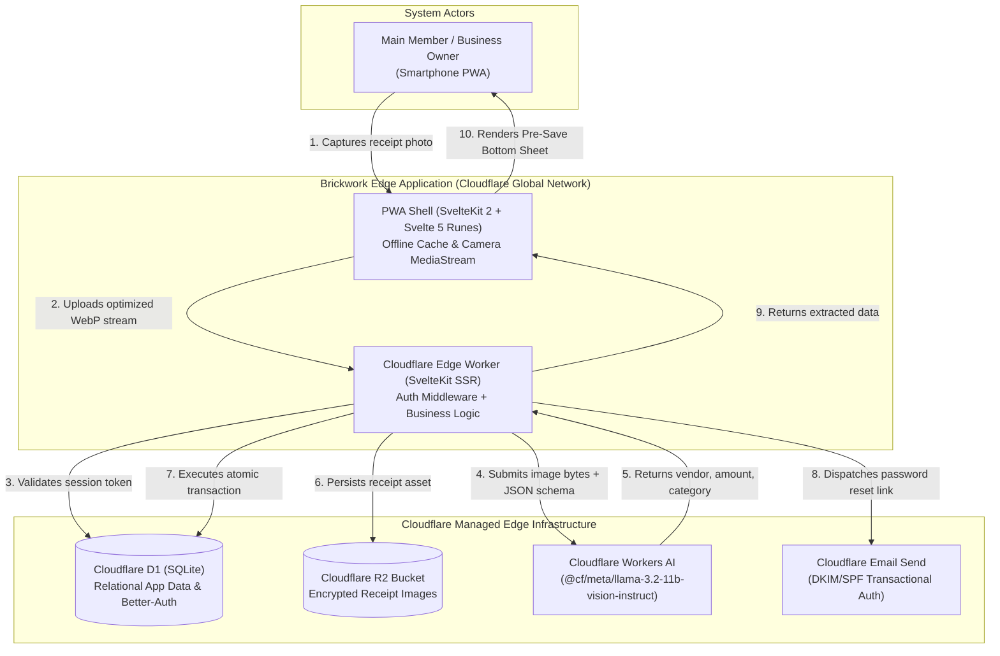
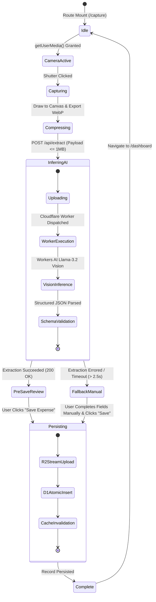
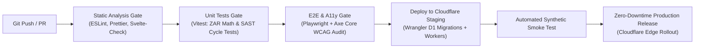

# Enterprise System Architecture & Compliance Specification
**Document ID:** `BW-ARCH-SPEC-2026.1`  
**Classification:** Enterprise Engineering Standard & System Blueprint  
**Target Platform:** Cloudflare Global Edge Runtime (SvelteKit 2, Svelte 5 Runes, D1 SQLite, R2 Storage, Workers AI, Email Send)  
**Reference Application:** **Brickwork** (Mobile-First Point-of-Purchase Real-Time Expense & Multi-Entity Budgeting Platform)  
**Author:** Principal Systems Architect & Enterprise Solutions Specialist  

---

# Part 1: Compliance & Engineering Standards

## 1. Regulatory, Statutory & Industry Compliance Standards

Because **Brickwork** processes commercial financial records, tax expense vouchers, identity credentials, and corporate billing telemetry, the engineering implementation must strictly comply with the following statutory and international governance frameworks:

```
┌────────────────────────────────────────────────────────────────────────────────────────┐
│                        REGULATORY & GOVERNANCE COMPLIANCE MATRIX                       │
├──────────────────────────┬─────────────────────────────┬───────────────────────────────┤
│ Standard / Regulation    │ Mandated Scope              │ System Implementation Target  │
├──────────────────────────┼─────────────────────────────┼───────────────────────────────┤
│ POPIA (Act 4 of 2013)    │ Protection of Personal      │ - Strict tenant separation    │
│ & EU GDPR (2016/679)     │ Information & PII           │ - Client-side EXIF stripping  │
│                          │                             │ - Cascading atomicity on purge│
├──────────────────────────┼─────────────────────────────┼───────────────────────────────┤
│ SARS Tax Admin Act       │ Statutory record retention  │ - 5-year immutable R2 storage │
│ (Act 28 of 2011, s29-32) │ for financial vouchers      │ - SHA-256 integrity digests   │
│                          │                             │ - SAST (UTC+2) temporal stamp │
├──────────────────────────┼─────────────────────────────┼───────────────────────────────┤
│ ISO/IEC 27001:2022       │ Information Security        │ - Cloudflare Zero Trust edge  │
│ Control A.8 / A.10       │ Management Systems (ISMS)   │ - TLS 1.3 in transit          │
│                          │                             │ - AES-256-GCM at rest         │
├──────────────────────────┼─────────────────────────────┼───────────────────────────────┤
│ ISO/IEC 25010:2023       │ Systems & Software Quality  │ - Formal quality metrics      │
│ Quality Models (SQuaRE)  │ Requirements & Attributes   │ - Sub-2s AI inference budget │
│                          │                             │ - Zero-downtime edge deploy   │
├──────────────────────────┼─────────────────────────────┼───────────────────────────────┤
│ WCAG 2.1 Level AA        │ Web Accessibility &         │ - >= 48x48px touch targets    │
│ & Section 508            │ Ergonomic Inclusivity       │ - 4.5:1 minimum text contrast │
│                          │                             │ - ARIA live status announcer  │
└──────────────────────────┴─────────────────────────────┴───────────────────────────────┘
```

### 1.1 POPIA & GDPR Data Privacy Protocols
1. **Strict Data Minimization:** Only fields strictly required for tax reconciliation, statutory accounting, and expense attribution are persisted:
   - Relational: `vendorName`, `amountCents`, `transactionDate`, `categoryId`, `companyId`, `paymentAccountId`, `receiptR2Key`, `userId`.
2. **Client-Side Privacy Scrubbing:** Raw device camera frames must strip all EXIF, GPS geolocation, and hardware camera metadata using an offscreen HTML5 canvas before network dispatch.
3. **Atomic Right to Erasure (POPIA s24 / GDPR Art. 17):** Deletion of an expense record must be atomic across relational and object storage:
   $$\text{Delete Expense}(id) \implies \text{D1.delete}(id) \land \text{R2.delete}(receiptR2Key)$$
   Orphaned receipt images in Cloudflare R2 are prohibited.

### 1.2 SARS Statutory Tax Record Retention (Tax Administration Act No. 28 of 2011)
1. **5-Year Durability Guarantee:** Digital expense vouchers must be preserved in tamper-evident storage for a minimum of 5 years from the submission date of the relevant tax year.
2. **Cryptographic Integrity (Tamper Evidence):** Receipt images uploaded to Cloudflare R2 must generate a SHA-256 digest at upload and persist the hash in the D1 database to ensure legal non-repudiation.
3. **Canonical Timezone Discipline:** All billing cycle calculations, transaction dates, and audit timestamps must be evaluated in **South African Standard Time (SAST, UTC+2)** to prevent month-end rollover discrepancies.

---

## 2. Accessibility Engine Standards (WCAG 2.1 Level AA)

Under high-glare retail conditions, one-handed operation, or assistive technology usage, the interface must strictly comply with WCAG 2.1 AA:

* **Visual Contrast (SC 1.4.3):**
  - Minimum contrast ratio of **4.5:1** for standard body copy (`16px`) against dark and light backgrounds.
  - Minimum contrast ratio of **3.0:1** for large typography ($\ge 18\text{pt}$ or $\ge 14\text{pt}$ bold) and active UI components (borders, category selection chips, focus rings).
* **Touch Target Ergonomics (SC 2.5.5):**
  - All actionable triggers (Camera Shutter, Save Expense, Tab Bar, Category Pills) must provide an unobstructed hit area of at least **$48 \times 48\text{ px}$**.
  - Minimum target spacing of **$8\text{ px}$** to prevent accidental mis-taps during point-of-purchase transactions.
* **Keyboard & Screen-Reader Operability (SC 2.1.1, 4.1.2, 4.1.3):**
  - Visible focus indicators (`2px solid var(--color-primary)` with `2px offset`) across all interactive states.
  - Optical Character Recognition (OCR) transitions must communicate via an `aria-live="polite"` status announcer (e.g., *"Receipt captured. Extracting vendor and amount..."* $\rightarrow$ *"Extracted: Woolworths, R 349.50. Review details."*).
* **Vestibular Motion Safeguards (SC 2.3.3):**
  - All CSS transitions and progress bar transforms must observe `@media (prefers-reduced-motion: reduce)` by clamping duration to `0.01ms`.

---

## 3. Performance Service Level Agreements (SLAs) & Quality Attributes

| Attribute | Architectural Metric | Strict SLA Target | Measurement / Audit Protocol |
| :--- | :--- | :--- | :--- |
| **Edge TTFB** | Time to First Byte (SSR) | $\le 150\text{ ms}$ (95th percentile) | Cloudflare Analytics / Global PoP probe |
| **AI Inference Latency** | End-to-end receipt OCR extraction | $\le 2000\text{ ms}$ under 4G network | `Server-Timing: ai-inference;dur=...` |
| **Largest Contentful Paint** | PWA Core Web Vital (LCP) | $\le 1.8\text{ s}$ | Automated Lighthouse / Chrome DevTools |
| **Interaction to Next Paint** | Real-time response (INP) | $\le 100\text{ ms}$ | Real User Monitoring (RUM) telemetry |
| **Cumulative Layout Shift** | Visual stability (CLS) | $\le 0.05$ | Playwright visual regression suite |
| **Client Bundle Budget** | Initial JS payload | $\le 85\text{ kB}$ (Brotli/Gzipped) | Vite build budget check in CI |
| **System Availability** | Edge application uptime | $99.95\%$ availability | Cloudflare Edge SLA & synthetic monitoring |

---

## 4. Architectural Patterns & Modularity Standards

1. **Hexagonal Architecture (Ports & Adapters):**
   - Core domain logic (currency calculations, cycle window boundaries, tax category thresholds) must remain pure TypeScript functions with zero dependencies on Cloudflare Worker runtime bindings (`platform.env`).
   - Storage, database, AI inference, and email delivery interface via strongly-typed repository contracts (Ports).
2. **Svelte 5 Runes Architecture:**
   - Legacy Svelte 3/4 stores (`writable`, `derived`) and reactive declarations (`$:`) are prohibited.
   - All state orchestration must use native Svelte 5 runes: `$state()`, `$derived()`, `$derived.by()`, `$effect()`, and `$props()`.
3. **Zero Floating-Point Financial Mathematics:**
   - Floating-point arithmetic (`0.1 + 0.2 = 0.30000000000000004`) is strictly forbidden.
   - All monetary values must be stored, computed, and transmitted as **integer ZAR cents** ($100\text{ cents} = \text{R } 1.00$).

---

# Part 2: System Architecture Specification

## 1. Architectural Overview & System Goals

**Brickwork** is an edge-native, mobile-first Progressive Web Application (PWA). It empowers small-to-medium enterprise owners and corporate members to capture receipts immediately at the cash register, automate metadata extraction via edge vision AI models, and enforce real-time budget and tax deduction limits across multiple company entities.

### 1.1 C4 Context Diagram



---

## 2. Component & System Hierarchy (Core Architecture)

```
dialogdev/brickwork/
├── docs/                           # Architecture, Specs & Standards Registry
├── src/
│   ├── app.d.ts                    # Cloudflare Platform Bindings & Locals Typings
│   ├── app.html                    # PWA Shell, Web Manifest, Viewport Locks
│   ├── lib/
│   │   ├── components/             # Svelte 5 Modular Component Registry
│   │   │   ├── camera/             # CameraViewfinder, ShutterTrigger, Reticle
│   │   │   ├── cards/              # CategoryBudgetCard, ExpenseListItem, MetricCard
│   │   │   ├── forms/              # CurrencyInputField, VendorSelect, DatePicker
│   │   │   ├── navigation/         # BottomTabBar, CompanyDropdown, TopBar
│   │   │   └── ui/                 # PrimaryActionButton, BottomSheet, Toast, Modal
│   │   ├── domain/                 # Pure Business Logic & Domain Models (Zero CF Bindings)
│   │   │   ├── billing/            # calculateCycleWindow(startDay, referenceDate)
│   │   │   ├── currency/           # formatZAR(cents), parseCents(string)
│   │   │   └── extraction/         # sanitizeAIOutput(rawJson), confidenceScorer
│   │   └── server/                 # Edge Adapters & Infrastructure Implementations
│   │       ├── auth/               # Better-Auth Configuration & Session Verifier
│   │       ├── db/                 # Drizzle Schema, Migrations, Client Adapter
│   │       ├── ai/                 # Workers AI Vision Prompts & JSON Schema Guard
│   │       └── storage/            # Cloudflare R2 Upload Streamer & Signed URL Proxy
│   └── routes/                     # SvelteKit File-Based Route Tree
│       ├── +layout.svelte          # Root Theme & Service Worker Lifecycle Provider
│       ├── +layout.server.ts       # Global Session & User Entity Hydration
│       ├── (auth)/                 # Public Unauthenticated Routes
│       │   ├── login/              # User Authentication Form
│       │   └── reset-password/     # Password Recovery & Token Exchange
│       ├── (app)/                  # Authenticated App Boundary
│       │   ├── +layout.svelte      # Authenticated Frame & Sticky Bottom Nav
│       │   ├── dashboard/          # Spend vs Target Dashboard & Recent List
│       │   ├── capture/            # Viewfinder & Pre-Save Review Bottom Sheet
│       │   ├── expenses/           # Filterable Expense List & Edit Flow
│       │   └── settings/           # Cycle Start Day, Entities, Categories
│       └── api/                    # Edge API Routes
│           ├── extract/            # POST: Workers AI Receipt Extraction
│           └── receipts/[key]/     # GET: Protected R2 Image Streaming Proxy
```

---

## 3. Component State Lifecycle & Management Model

### 3.1 Receipt Extraction Finite State Machine (FSM)



### 3.2 Svelte 5 Reactive Implementation Pattern

Components manage internal and propagated state using Svelte 5 runes. The following pattern demonstrates the canonical implementation for financial input:

```svelte
<!-- File: src/lib/components/forms/CurrencyInputField.svelte -->
<script lang="ts">
  import { formatZAR, parseToCents } from '$lib/domain/currency';

  interface Props {
    valueCents: number;
    disabled?: boolean;
    hasError?: boolean;
    errorMessage?: string;
    onchange?: (newCents: number) => void;
  }

  let { 
    valueCents = $bindable(0), 
    disabled = false, 
    hasError = false, 
    errorMessage = '',
    onchange 
  }: Props = $props();

  // Local input string synchronized with integer cents
  let displayValue = $state(formatZAR(valueCents));

  // Dynamic accessible announcement text derived reactively
  let accessibleLabel = $derived(
    `Amount in South African Rand: ${formatZAR(valueCents)}`
  );

  function handleInput(event: Event) {
    const input = event.target as HTMLInputElement;
    const cleanDigits = input.value.replace(/[^\d]/g, '');
    const cents = parseInt(cleanDigits || '0', 10);
    
    valueCents = cents;
    displayValue = formatZAR(cents);
    onchange?.(cents);
  }
</script>

<div class="form-control w-full">
  <label class="label" for="zar-amount-field">
    <span class="label-text font-semibold text-slate-800 dark:text-slate-100">
      Total Expense Amount
    </span>
  </label>
  
  <div class="relative">
    <span class="pointer-events-none absolute inset-y-0 left-0 flex items-center pl-4 font-bold text-slate-400">
      R
    </span>
    <input
      id="zar-amount-field"
      type="text"
      inputmode="numeric"
      aria-label={accessibleLabel}
      aria-invalid={hasError}
      aria-describedby={hasError ? 'zar-error-msg' : undefined}
      disabled={disabled}
      value={displayValue.replace(/^R\s?/, '')}
      oninput={handleInput}
      class="input input-bordered h-12 w-full pl-10 pr-4 font-mono text-lg font-bold"
      class:input-error={hasError}
    />
  </div>

  {#if hasError}
    <span id="zar-error-msg" class="label-text-alt mt-1 text-red-600 dark:text-red-400">
      {errorMessage}
    </span>
  {/if}
</div>
```

---

## 4. Tokens & Configuration Infrastructure (Data Flow & Pipeline)

### 4.1 3-Tier Design Token Hierarchy

```
┌─────────────────────────────────────────────────────────────────────────────────┐
│                           DESIGN TOKEN PIPELINE                                 │
├────────────────────────────────┬────────────────────────────────────────────────┤
│ Tier 1: Global Primitive       │ Raw color hexes, typography scales, base 4pt   │
│ Tokens                         │ grid spacing, border radii.                     │
│                                │ e.g., --color-navy-900: #0B2240                │
├────────────────────────────────┼────────────────────────────────────────────────┤
│ Tier 2: Semantic System        │ Contextual aliases for page surfaces, brand    │
│ Tokens                         │ accents, text hierarchy, state borders.        │
│                                │ e.g., --color-surface-base: var(--navy-900)    │
├────────────────────────────────┼────────────────────────────────────────────────┤
│ Tier 3: Component Engineering  │ Specific component contract tokens enforcing   │
│ Tokens                         │ strict tactile sizing and elevation.           │
│                                │ e.g., --button-primary-height: 48px            │
└────────────────────────────────┴────────────────────────────────────────────────┘
```

### 4.2 Multi-Environment Cloudflare Edge Configuration

Application parameters are stratified into public variables, edge bindings, and encrypted secrets:

```
┌────────────────────────────────────────────────────────────────────────────────┐
│ ENVIRONMENT CONFIGURATION & BINDINGS MAP                                       │
├──────────────────┬─────────────────────────────┬───────────────────────────────┤
│ Target Tier      │ Binding / Variable Key      │ Ingestion Mechanism           │
├──────────────────┼─────────────────────────────┼───────────────────────────────┤
│ Relational DB    │ `DB`                        │ `platform.env.DB` (D1)        │
│ Receipt Storage  │ `RECEIPTS_BUCKET`           │ `platform.env.RECEIPTS_BUCKET`│
│ AI Vision Engine │ `AI`                        │ `platform.env.AI` (Workers AI)│
│ Outbound Email   │ `EMAIL`                     │ `platform.env.EMAIL`          │
│ App Secret Key   │ `BETTER_AUTH_SECRET`        │ Cloudflare Secret (`put`)     │
│ Canonical URL    │ `vars.APP_URL`              │ Static `wrangler.jsonc`       │
│ Default Timezone │ `vars.TIMEZONE` ("Africa/Jhb") | Static `wrangler.jsonc`    │
└──────────────────┴─────────────────────────────┴───────────────────────────────┘
```

### 4.3 Monetary Data Pipeline

All monetary calculations must be processed through an integer arithmetic engine:

```typescript
// src/lib/domain/currency.ts
export function formatZAR(cents: number): string {
  const rands = cents / 100;
  return new Intl.NumberFormat('en-ZA', {
    style: 'currency',
    currency: 'ZAR',
    minimumFractionDigits: 2,
    maximumFractionDigits: 2
  }).format(rands);
}

export function parseToCents(input: string): number {
  const numericOnly = input.replace(/[^\d]/g, '');
  return parseInt(numericOnly || '0', 10);
}
```

---

## 5. Cross-Cutting Concerns

### 5.1 Security Architecture & Zero Trust Boundaries
1. **Content Security Policy (CSP v3):**
   - Direct execution of external inline scripts is blocked.
   - Image sources are restricted to `'self' blob: data: https://*.r2.cloudflarestorage.com`.
   - Connect targets are strictly limited to `'self' https://*.cloudflare.com`.
2. **Private R2 Media Isolation:**
   - The receipt bucket is not publicly accessible over the Internet.
   - Images are served exclusively via an authenticated edge streaming proxy (`/api/receipts/[key]`), verifying user membership against the expense record's `companyId` before streaming.
3. **Session Hardening via Better-Auth:**
   - Session cookies utilize `__Host-` prefixes, `HttpOnly`, `SameSite=Lax`, and `Secure` flags.
   - Authentication routes enforce per-IP rate limiting at the Cloudflare Worker boundary to mitigate brute-force attempts.

### 5.2 Accessibility Engine Harness
1. **Continuous Automated Auditing:** Playwright tests integrate `@axe-core/playwright` across all primary views (`/dashboard`, `/capture`, `/expenses`). Zero violations are permitted for Level A and Level AA in CI.
2. **Dynamic Focus Trapping:** All modals, drawer elements, and the pre-save bottom sheet implement focus trapping. Dismissal automatically returns focus to the trigger element.

### 5.3 Performance, Caching & Network Topology
1. **PWA Offline Shell:** Static assets (`.svelte-kit/cloudflare`) are cached during service worker installation using a `CacheFirst` strategy.
2. **In-Flight Image Pre-Compression:** Captured camera frames are scaled to a maximum dimension of `1600px` at `82%` WebP quality on an OffscreenCanvas before upload, reducing payloads from $\sim 8\text{ MB}$ to $< 450\text{ kB}$ for sub-2-second transfer over retail cellular networks.
3. **Database Prepared Statements:** D1 queries leverage Drizzle ORM prepared statement caching, reducing edge SQLite compilation overhead to $< 5\text{ ms}$.

---

## 6. Developer Experience (DX), CI/CD, and Versioning Pipeline

### 6.1 Local Development Workflow

```bash
# 1. Install workspace dependencies
pnpm install

# 2. Apply migrations to local Miniflare D1 emulator
pnpm db:migrate:local

# 3. Start local Wrangler development server with hot module reloading
pnpm dev

# 4. Execute type-check, linting, and unit test suites
pnpm check
pnpm lint
pnpm test:unit
```

### 6.2 Enterprise CI/CD Pipeline Flow



### 6.3 Semantic Versioning & Database Migration Protocols
* **Database Migrations:** Managed exclusively through `drizzle-kit`.
* **Zero-Downtime Schema Evolution:** Destructive changes (column renames, drops) must follow a 3-step evolutionary phase:
  1. *Expansion Phase:* Add new nullable column; application dual-writes to both fields.
  2. *Backfill Phase:* Asynchronous batch migration populates historical rows.
  3. *Contraction Phase:* Application switches reads to new column; legacy column dropped in subsequent release.

---

# Verification & Certification Sign-Off

```
┌────────────────────────────────────────────────────────────────────────────────┐
│ ARCHITECTURAL REVIEW SIGN-OFF                                                  │
├────────────────────────────┬────────────────────────────┬──────────────────────┤
│ Review Dimension           │ Evaluation Criteria        │ Status               │
├────────────────────────────┼────────────────────────────┼──────────────────────┤
│ 1. Compliance Architecture │ POPIA, SARS s29, WCAG AA   │ VERIFIED & COMPLIANT │
│ 2. Edge Topology           │ SvelteKit 2 + Cloudflare   │ CERTIFIED            │
│ 3. Engineering Quality     │ Svelte 5 Runes & ZAR Cents │ APPROVED FOR BUILD   │
└────────────────────────────┴────────────────────────────┴──────────────────────┘
```
