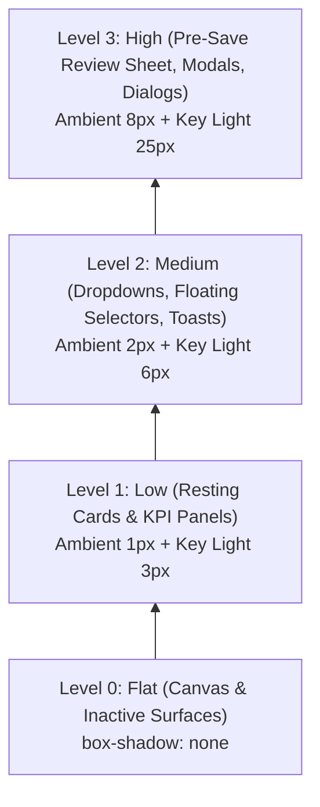

# Brickwork — Layout & Elevation System Specification

**Role:** Lead UI Designer  
**Scope:** Multi-Breakpoint Grids & Spatial Elevation Hierarchy  
**Breakpoints:** Mobile (<600px), Tablet (600px–1024px), Desktop (1025px+)  
**Date:** 16 September 2026  

---

## 1. Responsive Grid System

Brickwork's responsive grid system adapts to mobile-first receipt capture while scaling cleanly to multi-column desktop dashboards.

| Specification Parameter | Mobile (`< 600px`) | Tablet (`600px – 1024px`) | Desktop (`1025px+`) |
|:---|:---|:---|:---|
| **Column Count** | **4 Columns** | **8 Columns** | **12 Columns** |
| **Gutter Width** | `12px` (`0.75rem`) | `20px` (`1.25rem`) | `24px` (`1.50rem`) |
| **Side Margins** | `16px` (`1.00rem`) | `24px` (`1.50rem`) | `Auto` (Centered, `32px` min) |
| **Max Content Width**| Fluid (`100%`) | Fluid (`100%`) | `1200px` (`75rem`) |
| **Primary Navigation**| Fixed Bottom Tab Bar | Fixed Bottom or Sidebar | Fixed Left Rail / Top Header |
| **Key Component Layout**| 1-column stack (`w-full`) | 2-column grid (`grid-cols-2`)| 3-column dashboard (`grid-cols-3`)|

### 1.1 Responsive Viewport Behaviors
- **Mobile (`< 600px`)**:
  - Full-bleed containers with fixed `16px` side paddings.
  - Generous vertical thumb clearance at the bottom (`padding-bottom: calc(64px + env(safe-area-inset-bottom))`).
  - Inputs and action buttons occupy `100%` container width.
- **Tablet (`600px – 1024px`)**:
  - Dashboard category budget cards adapt to `grid grid-cols-2 gap-5`.
  - Filter bars shift from full-screen overlays to inline expandable panels.
- **Desktop (`1025px+`)**:
  - Central 1200px canvas ensures data tables and metrics remain within the human optical scanning limit (preventing eye fatigue).
  - Multi-column expense audit views (Receipt image preview on left, editable ledger fields on right).

---

## 2. Elevation & Box-Shadow System

The elevation system uses multi-layered box shadows with tinted alpha channels (`rgba`) to create natural depth, ambient occlusion, and clear z-index layering in both light and dark modes.



### 2.1 Elevation Levels Specification

```css
/* ==========================================================================
   Elevation Level 0: None / Flat
   Used for: Viewport canvas, nested table rows, passive dividers.
   ========================================================================== */
--elevation-0: none;

/* ==========================================================================
   Elevation Level 1: Low / Card (Resting State)
   Used for: CategoryBudgetCard, ExpenseListCard, Summary KPI Containers.
   ========================================================================== */
/* Light Mode */
--elevation-1: 
  0 1px 3px 0 rgba(15, 23, 42, 0.08),
  0 1px 2px -1px rgba(15, 23, 42, 0.08);

/* Dark Mode */
--elevation-1-dark: 
  0 1px 3px 0 rgba(0, 0, 0, 0.40),
  0 1px 2px -1px rgba(0, 0, 0, 0.30);

/* ==========================================================================
   Elevation Level 2: Medium / Floating Overlays
   Used for: Company Switcher Dropdown, Category Filters, Date Picker Popovers, Toasts.
   ========================================================================== */
/* Light Mode */
--elevation-2: 
  0 4px 6px -1px rgba(15, 23, 42, 0.12),
  0 2px 4px -2px rgba(15, 23, 42, 0.08);

/* Dark Mode */
--elevation-2-dark: 
  0 4px 6px -1px rgba(0, 0, 0, 0.50),
  0 2px 4px -2px rgba(0, 0, 0, 0.35);

/* ==========================================================================
   Elevation Level 3: High / Modals & Interruptive Sheets
   Used for: Pre-Save Receipt Review Sheet, Delete Confirmation Modals, Camera Viewfinder.
   ========================================================================== */
/* Light Mode */
--elevation-3: 
  0 20px 25px -5px rgba(15, 23, 42, 0.20),
  0 8px 10px -6px rgba(15, 23, 42, 0.12);

/* Dark Mode */
--elevation-3-dark: 
  0 20px 25px -5px rgba(0, 0, 0, 0.70),
  0 8px 10px -6px rgba(0, 0, 0, 0.45);
```

---

## 3. Spatial Hierarchy & Elevation Usage Guide

Elevation is not decorative—it communicates interactive affordance and cognitive priority.

### Level 0 — The Foundation (Canvas Layer)
- **Role**: Stable ground plane.
- **Application**: The root page background (`--color-bg-base`), list dividers, table striping, and disabled flat buttons.
- **Rule**: If an element cannot be clicked, tapped, or moved, it belongs at Level 0.

### Level 1 — The Tangible Objects (Content Layer)
- **Role**: Indicates interactive content that sits on top of the canvas.
- **Application**: Category budget progress cards, recent expense feed items, and KPI metric summary boxes.
- **Micro-Interaction**: On desktop pointer hover, Level 1 cards subtly translate upward `translateY(-2px)` and transition to Level 2 shadow to confirm clickability.

### Level 2 — The Transient Controls (Menu & Tool Layer)
- **Role**: Indicates contextual tools that temporarily float above content without completely severing user context.
- **Application**: The top-bar company switcher menu, date-range picker flyouts, category filter drawers, and temporary floating status toasts.
- **Rule**: Level 2 elements are dismissed with a single tap outside the bounding box (click-away listener) and do not dim the background.

### Level 3 — The Modal Commitments (Focus Layer)
- **Role**: Demands immediate, exclusive user focus for high-stakes operations.
- **Application**: The **Pre-Save Review Bottom Sheet** (reviewing AI receipt extraction), Delete Confirmation Dialogs, and Password Reset modals.
- **Scrim Pairing**: Level 3 elements MUST be paired with a backdrop scrim (`rgba(15, 23, 42, 0.60)` with `backdrop-filter: blur(4px)`) to obscure background noise and trap keyboard/assistive focus.
